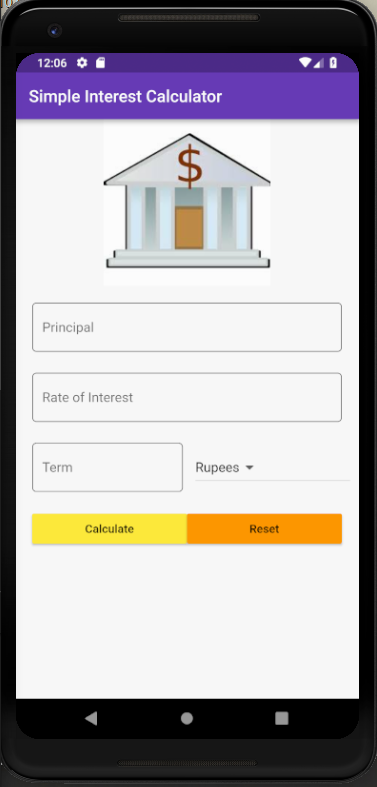
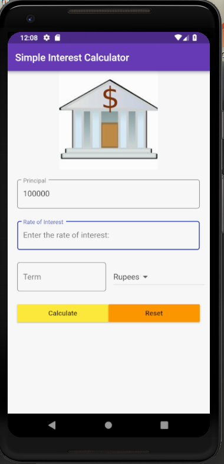
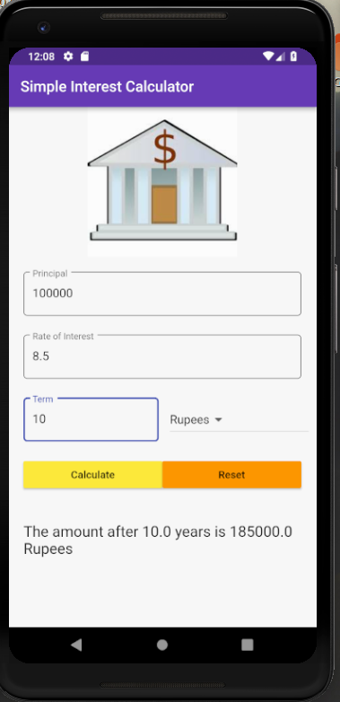
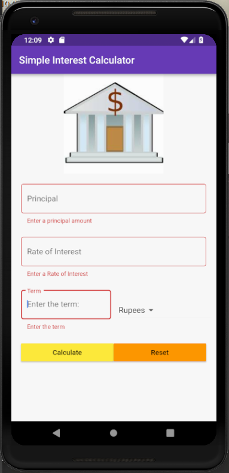

# Simple-Interest-Calculator
A Flutter app that is used to calculate the returns for a certain principal amount at a given rate for a period of time.

The Principal amount is calculated by:
```
principalAmount = (principalAmount) + (principalAmount*rate*term)/100
```

<hr>





